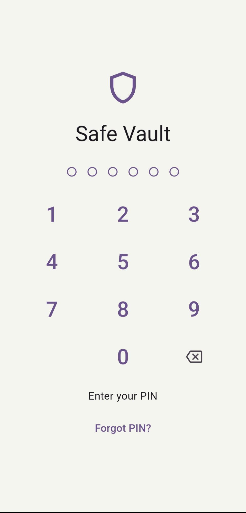
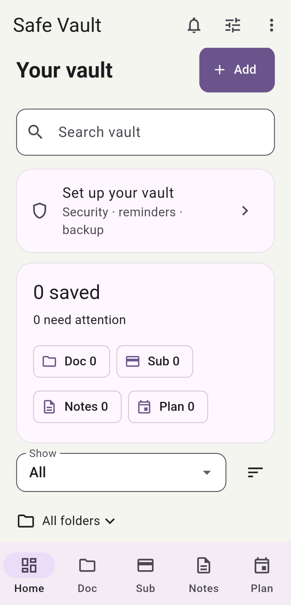
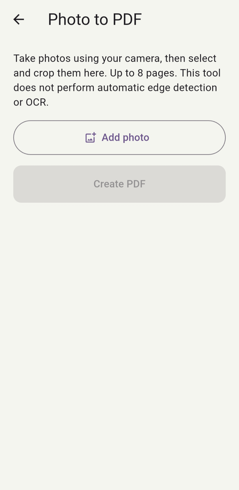
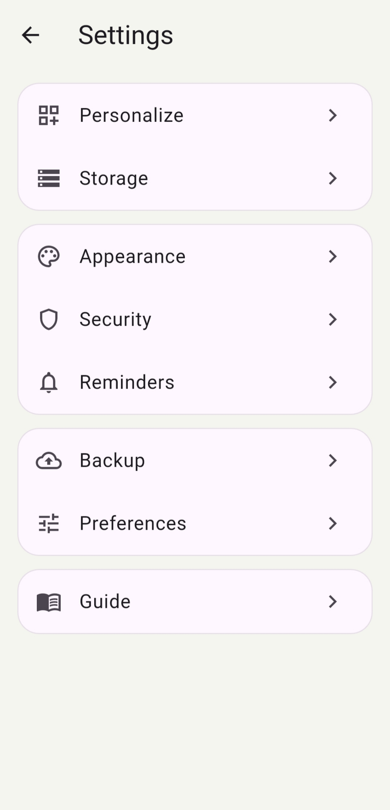
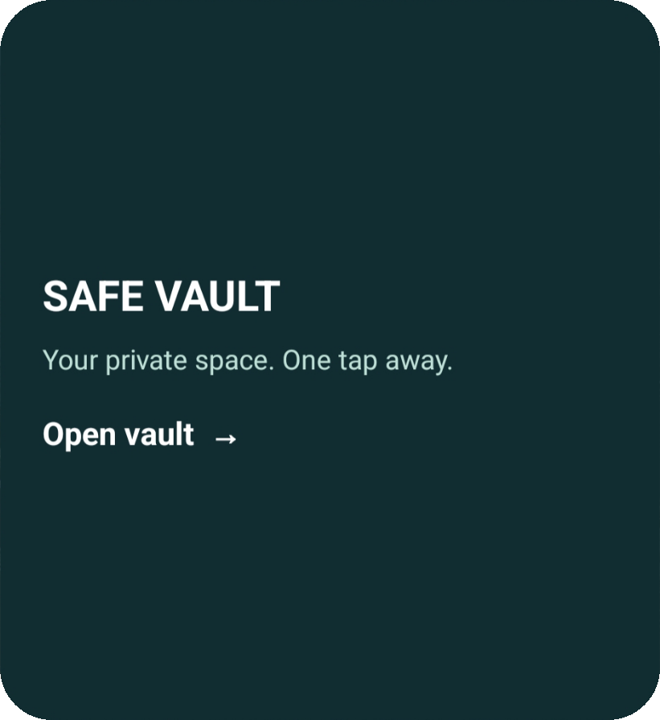
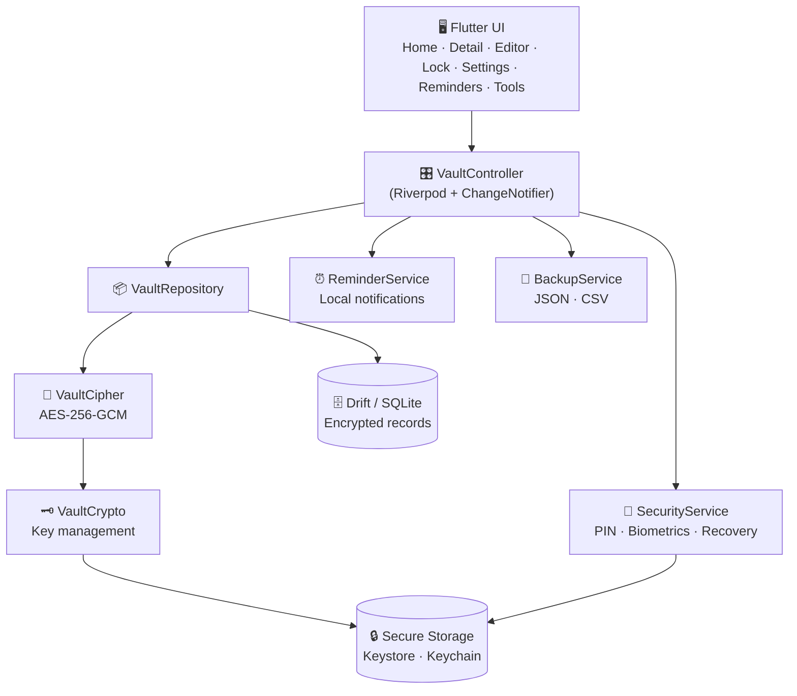
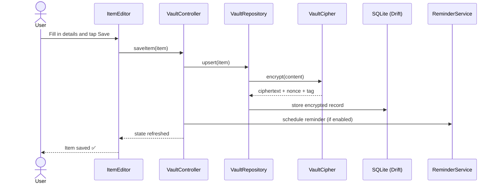
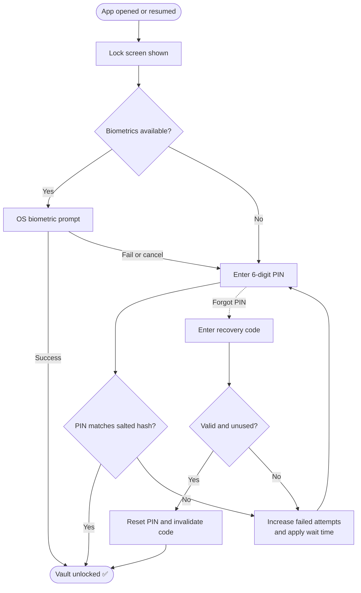

<div align="center">

# 🔐 SafeVault

### A private, local-first personal organizer for the things you can't afford to lose.

Documents · Subscriptions · Notes · Tasks · Reminders — encrypted and stored only on **your** device.


[**⬇️ Download APK**](../../releases/latest) · [**✨ Features**](#-features) · [**🏗 Architecture**](#-architecture) · [**🚀 Getting Started**](#-getting-started) · [**🐞 Report a Bug**](../../issues)

</div>

---

## 📖 Table of Contents

- [About the Project](#-about-the-project)
- [Features](#-features)
- [Screenshots](#-screenshots)
- [Architecture](#-architecture)
- [Security Design](#-security-design)
- [Tech Stack](#-tech-stack)
- [Project Structure](#-project-structure)
- [Getting Started](#-getting-started)
- [Download the APK](#-download-the-apk)
- [Testing](#-testing)
- [Platform Support](#-platform-support)
- [Known Limitations](#-known-limitations)
- [Roadmap](#-roadmap)
- [Contributing](#-contributing)
- [License](#-license)
- [Author](#-author)

---

## 💡 About the Project

Most organizer apps ask you to create an account and upload your personal data to someone else's server.
**SafeVault does the opposite.**

SafeVault is a **local-first** app: there is no backend, no login, no cloud sync and no tracking.
Everything you store (IDs, insurance papers, subscriptions, private notes, to-dos) lives in an
encrypted database on your own device and is protected by a PIN and/or your fingerprint or face.

> **Why local-first?**
> Your documents are among the most sensitive data you own. If it never leaves your device,
> it can't be leaked from a server.

| Without SafeVault | With SafeVault |
|---|---|
| Documents scattered across galleries, chats and email | One organized, searchable place |
| Missed renewals and expiry dates | Local reminders before things expire |
| Forgotten subscriptions quietly draining money | Recurring costs visible at a glance |
| Private data on third-party servers | Encrypted storage that stays on your device |

---

## ✨ Features

### 🗂 Organize

| Feature | Description |
|---|---|
| **Four item types** | Documents, Subscriptions, Notes and Tasks |
| **Folders and tags** | Keep related items together |
| **Search, filter and sort** | Debounced search with filters by type and sorting options |
| **Subscription tracking** | Amounts, currencies and recurrence, with a monthly-cost equivalent |
| **Money handled safely** | Amounts stored as integer minor units to avoid rounding errors |

### 🔒 Protect

| Feature | Description |
|---|---|
| **AES-256-GCM encryption** | Item content is encrypted before it is written to the database |
| **6-digit PIN lock** | Stored only as a salted hash, never as plain text |
| **Biometric unlock** | Fingerprint or face unlock through the operating system |
| **Recovery codes** | Hashed, single-use codes to regain access if the PIN is forgotten |
| **Attempt rate limiting** | Wrong PIN or recovery code attempts trigger waiting periods |
| **Auto-lock** | Vault locks when the app is backgrounded or resumed |

### ⏰ Remember

| Feature | Description |
|---|---|
| **Local reminders** | On-device notifications, no push server involved |
| **Recurring reminders** | Daily, weekly, monthly and yearly, including leap-year and month-end handling |
| **Quiet hours** | Reminders that land in quiet hours are moved to an allowed time |
| **Reminder Center** | One screen to review upcoming reminders |
| **Notification deep links** | Tapping a reminder opens the related item |

### 🧰 Tools

| Feature | Description |
|---|---|
| **Attachments** | Attach files and images to any item, with duplicate detection by hash |
| **Photo to PDF** | Capture or pick a photo, crop it and convert it to a PDF |
| **Receipt import** | Pre-fill an item with merchant and amount from a receipt |
| **Calendar export** | Export dates as `.ics` for Google, Apple or Outlook calendars |
| **Backup and restore** | Export and import your data as JSON |
| **CSV export** | Spreadsheet-friendly export with formula-injection protection |
| **Android home-screen widget** | Quick access from the home screen |

### 🎨 Personalize

- Light and dark themes
- Accent colors and contrast options
- Glass-style cards (optional)
- Reduced-motion option

---

## 📸 Screenshots

> Add your screenshots to a `docs/screenshots/` folder and update the paths below.

<div align="center">

| Lock Screen | Home | Item Details | Editor |
|:---:|:---:|:---:|:---:|
|  |  |  |  |

| Reminders | Photo to PDF | Settings | Widget |
|:---:|:---:|:---:|:---:|
|  |  |  |  |

</div>

---

## 🏗 Architecture

SafeVault uses a layered architecture. The UI never talks to the database directly; it goes through a controller and a repository.



### 🔁 Saving an item



### 🔓 Unlock flow



---

## 🛡 Security Design

SafeVault is built in layers, so no single mechanism is the only line of defense.

| Layer | What it does |
|:---:|---|
| **1. App lock** | Vault locks on background, cover or resume |
| **2. PIN** | Verified against a salted hash; the raw PIN is never stored |
| **3. Biometrics** | Handled by the OS; the app only receives success or failure |
| **4. Encrypted content** | Item content is encrypted with AES-256-GCM before storage |
| **5. Secure key storage** | The encryption key lives in platform secure storage, not in the database |
| **6. Recovery codes** | Stored as hashes and invalidated after use |
| **7. Rate limiting** | Failed attempts produce increasing delays |

**Also in place**

- 🧪 Tests confirm private text does not appear in raw database content.
- 🧪 Tests confirm a PIN reset does not wipe unrelated secure-storage entries.
- 🛑 CSV export escapes values that could be interpreted as spreadsheet formulas.
- 🔍 There is no analytics, ad SDK, backend or remote API in the project.

> ⚠️ **Important:** exported backup files are **not** protected by the app lock. Store them somewhere safe.
> See [Known Limitations](#-known-limitations).

---

## 🧰 Tech Stack

| Area | Technology |
|---|---|
| **Framework** | Flutter, Dart |
| **State management** | Riverpod (`flutter_riverpod`) |
| **Database** | Drift on SQLite (`drift`, `drift_flutter`), SQLite WASM on web |
| **Encryption** | `cryptography` (AES-GCM, SHA-256) |
| **Secure storage** | `flutter_secure_storage` |
| **Biometrics** | `local_auth` |
| **Notifications** | `flutter_local_notifications`, `timezone`, `flutter_timezone` |
| **Files** | `file_picker` |
| **PDF** | `pdf` (generate), `pdfrx` (view) |
| **Utilities** | `intl`, `uuid` |
| **Native** | Kotlin (Android activity and widget), Swift (iOS and macOS) |

---

## 📂 Project Structure

```text
SafeVault/
├── lib/
│   ├── main.dart                 # Entry point and bootstrap
│   ├── core/                     # Logic, data and security
│   │   ├── model.dart            # Item, Kind, date and money helpers
│   │   ├── assets.dart           # Attachment/asset model
│   │   ├── receipt.dart          # Receipt draft model
│   │   ├── database.dart         # Drift database and migrations
│   │   ├── repository.dart       # Persistence boundary
│   │   ├── controller.dart       # VaultController and providers
│   │   ├── crypto.dart           # Key management
│   │   ├── cipher.dart           # AES-GCM encryption
│   │   ├── security.dart         # PIN, biometrics, recovery codes
│   │   ├── backup.dart           # JSON/CSV backup and restore
│   │   ├── calendar_export.dart  # .ics export
│   │   ├── reminders.dart        # Local notifications
│   │   └── reminder_rules.dart   # Recurrence and quiet hours
│   └── ui/                       # Screens and widgets
│       ├── app.dart              # App shell, theme, lock overlay
│       ├── design.dart           # Design system
│       ├── common.dart           # Shared widgets
│       ├── home.dart             # Main organizer screen
│       ├── detail.dart           # Item details
│       ├── editor.dart           # Create and edit items
│       ├── lock.dart             # PIN and biometric screen
│       ├── settings.dart         # Settings hub
│       ├── organizer_settings.dart
│       ├── tools_screen.dart
│       ├── item_tools.dart       # File manager and item options
│       ├── attachment_viewer.dart
│       ├── photo_pdf.dart        # Photo, crop and PDF
│       ├── receipt_import.dart
│       ├── reminder_center.dart
│       └── reminder_picker.dart
├── test/                         # 8 test files
├── assets/branding/              # App icons
├── android/ ios/ web/            # Platform projects
├── linux/ macos/ windows/
└── pubspec.yaml
```

---

## 🚀 Getting Started

### Prerequisites

- [Flutter SDK](https://docs.flutter.dev/get-started/install) **3.47 or newer** (Dart 3.13+)
- Android Studio or VS Code with the Flutter extension
- An Android device or emulator (or any other supported target)

Check your setup:

```bash
flutter doctor
```

### Run the app

```bash
# 1. Clone the repository
git clone https://github.com/<your-username>/<your-repo>.git
cd <your-repo>

# 2. Install dependencies
flutter pub get

# 3. Run on a connected device or emulator
flutter run
```

### Run on other platforms

```bash
flutter run -d chrome     # Web
flutter run -d windows    # Windows
flutter run -d linux      # Linux
flutter run -d macos      # macOS
```

> Web builds use a Drift worker and SQLite WASM. See `WEB_SETUP.md` for details.

### Build a release APK

```bash
flutter build apk --release
```

The file is created at:

```text
build/app/outputs/flutter-apk/app-release.apk
```

Smaller, per-device APKs:

```bash
flutter build apk --release --split-per-abi
```

---

## 📲 Download the APK

1. Go to the [**Releases**](../../releases/latest) page.
2. Download **`app-release.apk`** from the Assets section.
3. Open the file on your Android phone.
4. If prompted, allow **Install unknown apps** for your browser or file manager.
5. Open SafeVault and set your PIN.

**Verify your download (optional):** each release shows a SHA-256 checksum next to the file. Compare it with your copy:

```bash
# Windows
certutil -hashfile app-release.apk SHA256

# macOS / Linux
sha256sum app-release.apk
```

---

## 🧪 Testing

Run all tests:

```bash
flutter test
```

| Test file | What it covers |
|---|---|
| `core_test.dart` | Money and date parsing, JSON, repository CRUD, encryption at rest, attachments, PIN, CSV escaping |
| `lifecycle_test.dart` | Locking on resume and when covered, unlock navigation |
| `migration_test.dart` | Old database upgrades keep items and attachments |
| `organizer_test.dart` | Quiet hours, receipt parsing, calendar escaping, asset deduplication and purge |
| `recovery_test.dart` | Hashed recovery codes, single use, attempt limits, secure-storage safety |
| `reminder_regression_test.dart` | Recurrence, leap years, month ends, reminder patches |
| `ui_refresh_test.dart` | Biometric caching, forgot-PIN form, navigation labels, appearance settings |
| `widgets_test.dart` | PIN dots and basic widget behavior |

---

## 🌍 Platform Support

| Platform | Status | Notes |
|---|:---:|---|
| Android | ✅ | Primary target; includes home-screen widget and privacy channel |
| iOS | ✅ | Face ID usage description and `safevault` URL scheme configured |
| Web | ✅ | Drift worker and SQLite WASM; weaker key storage than native |
| Windows | ✅ | Standard Flutter desktop runner |
| macOS | ✅ | Biometric usage text configured |
| Linux | ✅ | Standard Flutter desktop runner |

---

## ⚠️ Known Limitations

Being upfront about what SafeVault does not do yet:

- **Exported backups are not encrypted or app-locked.** Treat JSON/CSV exports as sensitive files.
- **No cloud sync.** Data lives on one device; move it between devices with backup and restore.
- **Web security is weaker than native.** Browser storage does not match Android Keystore or iOS Keychain.
- **Receipt import is basic.** It extracts merchant and amount and uses no cloud OCR or AI.
- **Android widget and PDF rendering** are not covered by automated tests.
- **No account recovery beyond recovery codes.** If you lose both your PIN and your recovery code, the data cannot be recovered.

---

## 🗺 Roadmap

- [ ] Passphrase-encrypted backups
- [ ] Unique application ID and unified app name
- [ ] Backup, wipe and restore round-trip tests
- [ ] Localization support
- [ ] Better receipt parsing (on-device OCR)
- [ ] Play Store release
- [ ] Optional encrypted sync between devices

Have an idea? [Open an issue](../../issues) and let's talk.

---

## 🤝 Contributing

Contributions, bug reports and ideas are welcome.

1. Fork the repository
2. Create a branch: `git checkout -b feature/your-feature`
3. Commit your changes: `git commit -m "Add your feature"`
4. Push the branch: `git push origin feature/your-feature`
5. Open a Pull Request

Before submitting, please run:

```bash
flutter analyze
flutter test
```

---

## 📄 License

This project is licensed under the **MIT License**. Add a `LICENSE` file to the repository root, or change this section to match the license you choose.

---

## 👤 Author

**Monish**

- GitHub: [@your-username](https://github.com/your-username)

If you found SafeVault useful, consider giving it a ⭐ on GitHub!

<div align="center">

**Your data. Your device. Your vault.** 🔐

</div>
